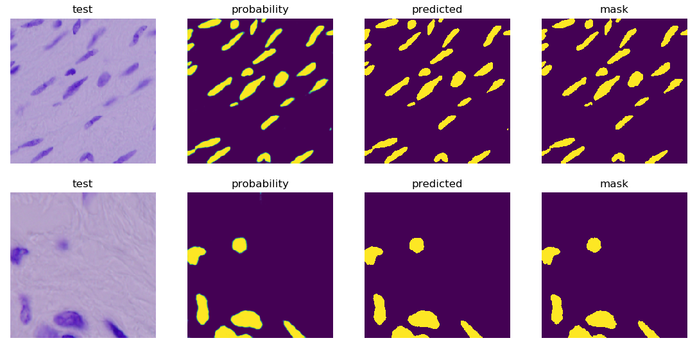
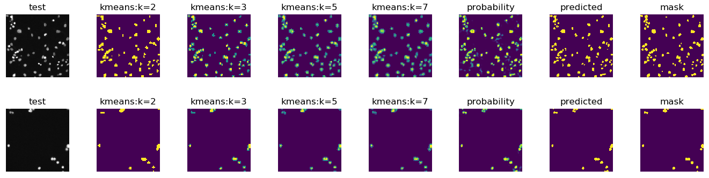

# Data-Science-Bowl-2018
Nuclei Segmentation

This contains all my implementations for DSB2018. My first pass through data contained an implemented of FCN, and I later went on to implement two versions of U-Net. Initial data exploration where I found some outliers in data along with FCN (Fully Convolutional Network) are available in the notebook.

**First Approach:**

I used a very large U-Net for semantic segmentation of nuclei cells. See results below:

**Second Approach**

In the second attempt, I used k-means clustering on images to produce additional images with different number of k (see below). This proved to be a good strategy as each images contained little variations in colors. All these images were combined to form a 7-channel image and fed to the U-Net.  See results below.

**How to Run**

To start training, simply run `main.py` file. All parameters are made available at the top under `constants`.  Module descriptions are provided below:

1. `dataloader.py` -- loads the data, provides batches for training with augmentation enabled, generates k-means cluster maps. 
2. `model.py` -- provides functions that return unet models for approach 1 and 2.
3. `trainer.py` -- when passed a dataloader object and model, it will train it with proper logging for training and validation to tensorboard.
4. `main.py` -- main file to run.